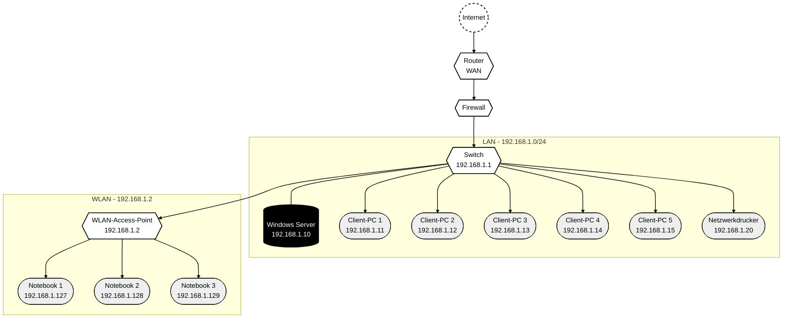

## Mermaid JS

```mermaid
graph TD
    Internet((Internet))
    Router{{Router<br/>WAN}}
    Firewall{{Firewall}}

    subgraph LAN ["LAN - 192.168.1.0/24"]
        Switch{{Switch<br/>192.168.1.1}}
        Server[(Windows Server<br/>192.168.1.10)]
        Client1([Client-PC 1<br/>192.168.1.11])
        Client2([Client-PC 2<br/>192.168.1.12])
        Client3([Client-PC 3<br/>192.168.1.13])
        Client4([Client-PC 4<br/>192.168.1.14])
        Client5([Client-PC 5<br/>192.168.1.15])
        Drucker([Netzwerkdrucker<br/>192.168.1.20])
    end

    subgraph WLAN ["WLAN - 192.168.1.2"]
        AccessPoint{{WLAN-Access-Point<br/>192.168.1.2}}
        Notebook1([Notebook 1<br/>192.168.1.127])
        Notebook2([Notebook 2<br/>192.168.1.128])
        Notebook3([Notebook 3<br/>192.168.1.129])
    end

    Internet --> Router
    Router --> Firewall
    Firewall --> Switch
    Switch --- Server
    Switch --> Client1
    Switch --> Client2
    Switch --> Client3
    Switch --> Client4
    Switch --> Client5
    Switch --> Drucker
    Switch --> AccessPoint
    AccessPoint --> Notebook1
    AccessPoint --> Notebook2
    AccessPoint --> Notebook3

    classDef netzwerk fill:#fff,stroke:#000,stroke-width:2px,color:#000;
    classDef server fill:#000,stroke:#000,stroke-width:2px,color:#fff;
    classDef client fill:#eee,stroke:#000,stroke-width:1px,color:#000;
    classDef internet fill:#fff,stroke:#000,stroke-width:2px,stroke-dasharray:5 5,color:#000;
    linkStyle default stroke:#000,stroke-width:1.5px;

    class Router,Firewall,Switch,AccessPoint netzwerk;
    class Server server;
    class Client1,Client2,Client3,Client4,Client5,Drucker,Notebook1,Notebook2,Notebook3 client;
    class Internet internet;
```

